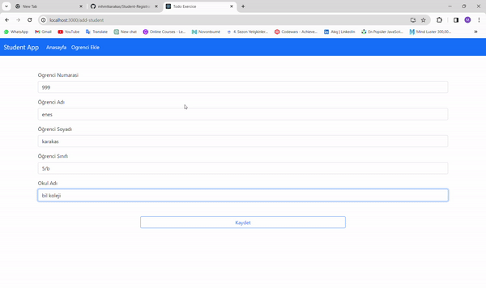

# Student Registration Project

* In this project, a student registration application for a school has been developed using the React technology along with react-router-dom to navigate between pages. To fetch data from a mock API, a db.json file has been created. Axios has been used to retrieve student information from the API. Student data fetched using Axios has been displayed on the screen, and when updates are made, both the database and the user interface are updated accordingly. useEffect has been used to handle the timing of our data.

